# Entity-Relationship Diagram

This conceptual ER diagram represents the normalized Phase 1 design. SQL data types will be selected in Phase 2.

```mermaid
erDiagram
    DEPARTMENTS ||--o{ EMPLOYEES : contains
    LOCATIONS ||--o{ EMPLOYEES : houses
    LOCATIONS ||--o{ ASSETS : stores
    EMPLOYEES ||--o| TECHNICIANS : may_be
    ASSET_TYPES ||--o{ ASSETS : classifies
    EMPLOYEES ||--o{ ASSET_ASSIGNMENTS : receives
    ASSETS ||--o{ ASSET_ASSIGNMENTS : assignment_history
    TECHNICIANS ||--o{ ASSET_ASSIGNMENTS : issues
    SOFTWARE_PRODUCTS ||--o{ SOFTWARE_LICENSES : has
    SOFTWARE_LICENSES ||--o{ LICENSE_ASSIGNMENTS : allocates
    EMPLOYEES ||--o{ LICENSE_ASSIGNMENTS : receives
    ASSETS ||--o{ LICENSE_ASSIGNMENTS : receives
    EMPLOYEES ||--o{ TICKETS : submits
    TECHNICIANS ||--o{ TICKETS : handles
    ASSETS ||--o{ TICKETS : referenced_by
    ASSETS ||--o{ MAINTENANCE_RECORDS : has
    TECHNICIANS ||--o{ MAINTENANCE_RECORDS : performs

    DEPARTMENTS {
        int department_id PK
        string department_name UK
    }
    LOCATIONS {
        int location_id PK
        string building
        string floor
        string room
        string city
        string state
    }
    EMPLOYEES {
        int employee_id PK
        string first_name
        string last_name
        string email UK
        date hire_date
        int department_id FK
        int location_id FK
        string employment_status
    }
    TECHNICIANS {
        int technician_id PK
        int employee_id FK
        string skill_level
        boolean active
    }
    ASSET_TYPES {
        int asset_type_id PK
        string asset_type_name UK
        string description
    }
    ASSETS {
        int asset_id PK
        string asset_tag UK
        string serial_number UK
        int asset_type_id FK
        string manufacturer
        string model
        date purchase_date
        decimal purchase_cost
        date warranty_expiration
        string status
        int location_id FK
    }
    ASSET_ASSIGNMENTS {
        int assignment_id PK
        int asset_id FK
        int employee_id FK
        date assigned_date
        date returned_date
        int assigned_by_technician_id FK
        string notes
    }
    SOFTWARE_PRODUCTS {
        int software_id PK
        string software_name
        string vendor
        string version
        string category
    }
    SOFTWARE_LICENSES {
        int license_id PK
        int software_id FK
        string license_key UK
        date purchase_date
        date expiration_date
        int seat_count
        decimal purchase_cost
        string status
    }
    LICENSE_ASSIGNMENTS {
        int license_assignment_id PK
        int license_id FK
        int employee_id FK
        int asset_id FK
        date assigned_date
        date revoked_date
    }
    TICKETS {
        int ticket_id PK
        int requester_employee_id FK
        int assigned_technician_id FK
        int related_asset_id FK
        string category
        string priority
        string status
        string subject
        string issue_description
        datetime opened_at
        datetime resolved_at
        datetime closed_at
    }
    MAINTENANCE_RECORDS {
        int maintenance_id PK
        int asset_id FK
        int technician_id FK
        string maintenance_type
        string description
        date start_date
        date completion_date
        decimal cost
        string vendor_name
    }
```

## Cardinality Notes

- `||` means exactly one.
- `o|` means zero or one.
- `o{` means zero or many.
- Optional foreign keys include a ticket's technician and related asset, plus the employee-or-asset target in a license assignment.
